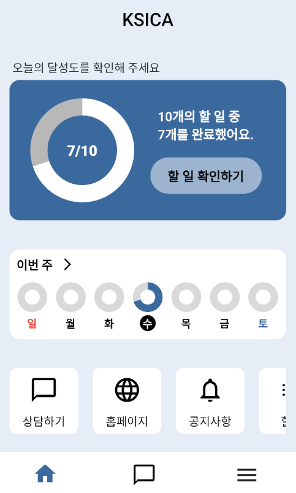
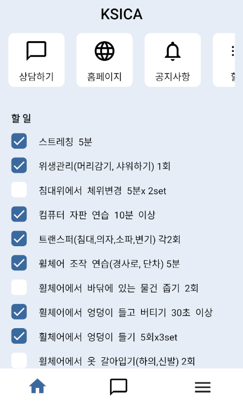
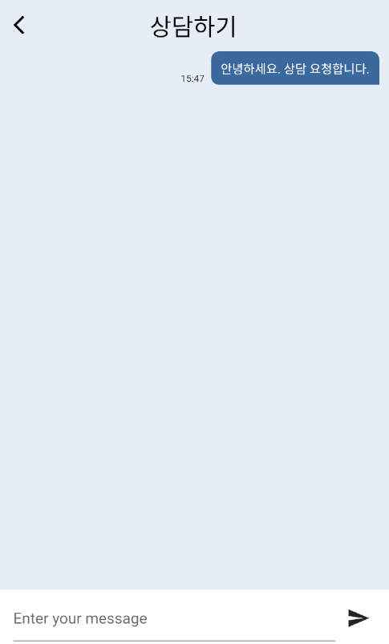
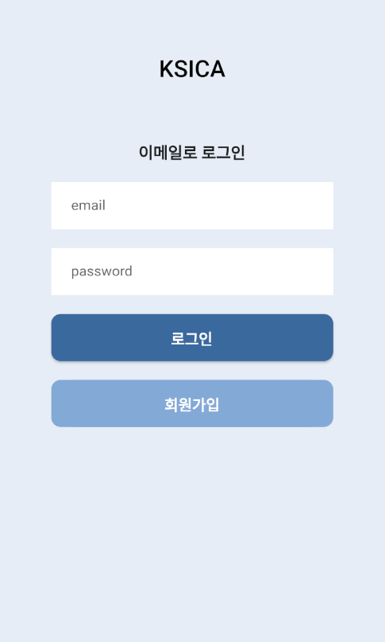
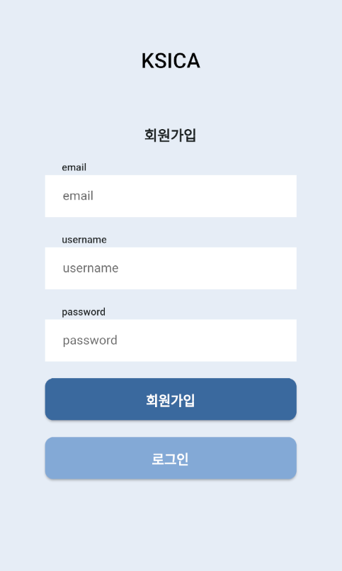

<a name="readme-top"></a>

[![Contributors][contributors-shield]][contributors-url]
[![Forks][forks-shield]][forks-url]
[![Stargazers][stars-shield]][stars-url]
[![Issues][issues-shield]][issues-url]

<!-- PROJECT LOGO -->
<br />
<div align="center">
  <a href="https://github.com/skj974600/kscia-app">
    
  </a>

  <h3 align="center">KSCIA APP</h3>

  <p align="center">
    Lifestyle app for people with spinal cord disability
    <br />
    <a href="https://github.com/skj974600/kscia-app"><strong>Explore the docs »</strong></a>
    <br />
    <br />
    <a href="https://github.com/skj974600/kscia-app">View Demo</a>
    ·
    <a href="https://github.com/skj974600/kscia-app/issues">Report Bug</a>
    ·
    <a href="https://github.com/skj974600/kscia-app/issues">Request Feature</a>
  </p>
</div>

<!-- TABLE OF CONTENTS -->
<details>
  <summary>Table of Contents</summary>
  <ol>
    <li>
      <a href="#about-the-project">About The Project</a>
      <ul>
        <li><a href="#built-with">Built With</a></li>
      </ul>
    </li>
    <li>
      <a href="#getting-started">Getting Started</a>
      <ul>
        <li><a href="#prerequisites">Prerequisites</a></li>
        <li><a href="#installation">Installation</a></li>
      </ul>
    </li>
    <li><a href="#usage">Usage</a></li>
    <li><a href="#contact">Contact</a></li>
  </ol>
</details>

<!-- ABOUT THE PROJECT -->

## About The Project

<!-- ![Product Screen Shot][product-screenshot] -->
<div style="display: flex; justify-content: space-between;">
    
    
    
    
    
</div>

&nbsp;

While there are websites dedicated to individuals with spinal cord injuries, there seemed to be a noticeable absence of mobile applications catering to their specific needs. Recognizing the physical challenges these individuals face, we believed that an easily accessible and user-friendly app was essential. Our goal was to provide on-the-go support and help foster a sense of community. Thus, we embarked on the development of a "Lifestyle App for Individuals with Spinal Cord Injuries". This app was crafted using the cross-platform framework, Flutter, ensuring compatibility with both Android and iOS devices. The backend, which provides the API, was developed using FastAPI.

Features include:

- A direct link to the Spinal Cord Injury Association website.
- A real-time chat system for counseling.
- Health and hygiene programs and checklists.

Through this app, we hope to simplify access to the services provided to individuals with spinal cord injuries, potentially enhancing their quality of life.

The current repository focuses on the client app component.

<p align="right">(<a href="#readme-top">back to top</a>)</p>

### Built With

This section lists major frameworks/systems used to this project.

- [![Flutter][Flutter]][Flutter-url]

<p align="right">(<a href="#readme-top">back to top</a>)</p>

<!-- GETTING STARTED -->

## Getting Started

This is an example of how you may give instructions on setting up your project locally.
To get a local copy up and running follow these simple example steps.

### Prerequisites

Install flutter and android studio and create an emulator.

- [Flutter Install][Flutter-Install-url]
- [Android Studio Intall][Android-Studio-Install-url]
- [Run Emulator][Run-Emulator-url]

### Installation

_Below is an example of how you can install and set up your app._

1. Clone the repo

   ```sh
   git clone https://github.com/skj974600/kscia-app.git
   ```

2. Install packages and set api url

   ```sh
   flutter pub get
   ```

   ```dart
   // ./config/url.dart
   const SERVER_URL = "http://server.url";
   const WEBSOCKET_SERVER_URL = "ws://server.url";
   ```

3. Run app

   ```sh
   flutter run lib/main.dart
   ```

<p align="right">(<a href="#readme-top">back to top</a>)</p>

<!-- USAGE EXAMPLES -->

## Usage

<a name="usage"></a>

<table>
  <tr>
<td>
    
</td>
    <td>
    <div><li>Home screen</li></div>&nbsp;
    <div><li>Donut chart of user’s today’s checklist performance</li></div>&nbsp;
    <div><li>Donut chart of user’s weekly checklist performance</li></div>&nbsp;
    <div><li>"Web portal, Announcements, Consultation" icon navigation.</li></div>&nbsp;
</td>
  </tr>
  <tr>
<td>
    
</td>
    <td>
    <div><li>To-do checklist: check status reflected in chart</li></div>&nbsp;
        
</td>

</tr>
  <tr>
<td>
    
</td>
    <td>
        <div><li>Consultation screen</li></div>&nbsp;
        <div><li>Consultation with users in real time is possible and the consultation details are saved</li></div>&nbsp;
</td>

  </tr>
  <tr>
<td>
    
</td>

<td>
        <div><li>Login and register screen</li></div>&nbsp;
        <div><li>Log in with email and password</li></div>&nbsp;
        <div><li>Sign up with email, name, and password</li></div>&nbsp;
        <div><li>Switch between login mode and membership registration mode</li></div>&nbsp;
</td>

</tr>
</table>
<p align="right">(<a href="#readme-top">back to top</a>)</p>

## Contact

`Letmedev` - <79841@naver.com>

Project Link: [https://github.com/skj974600/kscia-app](https://github.com/skj974600/kscia-app)

<p align="right">(<a href="#readme-top">back to top</a>)</p>

<!-- MARKDOWN LINKS & IMAGES -->

[contributors-shield]: https://img.shields.io/github/contributors/skj974600/kscia-app.svg?style=for-the-badge
[contributors-url]: https://github.com/skj974600/kscia-app/graphs/contributors
[forks-shield]: https://img.shields.io/github/forks/skj974600/kscia-app.svg?style=for-the-badge
[forks-url]: https://github.com/skj974600/kscia-app/network/members
[stars-shield]: https://img.shields.io/github/stars/skj974600/kscia-app.svg?style=for-the-badge
[stars-url]: https://github.com/skj974600/kscia-app/stargazers
[issues-shield]: https://img.shields.io/github/issues/skj974600/kscia-app.svg?style=for-the-badge
[issues-url]: https://github.com/skj974600/kscia-app/issues
[product-screenshot]: images/readme/product_screenshot.png
[Flutter]: https://img.shields.io/badge/Flutter-%2302569B.svg?style=for-the-badge&logo=Flutter&logoColor=white
[Flutter-url]: https://flutter.dev/
[Flutter-install-url]: https://docs.flutter.dev/get-started/install
[Android-Studio-install-url]: https://developer.android.com/studio
[Run-Emulator-url]: https://developer.android.com/studio/run/emulator?hl=en
